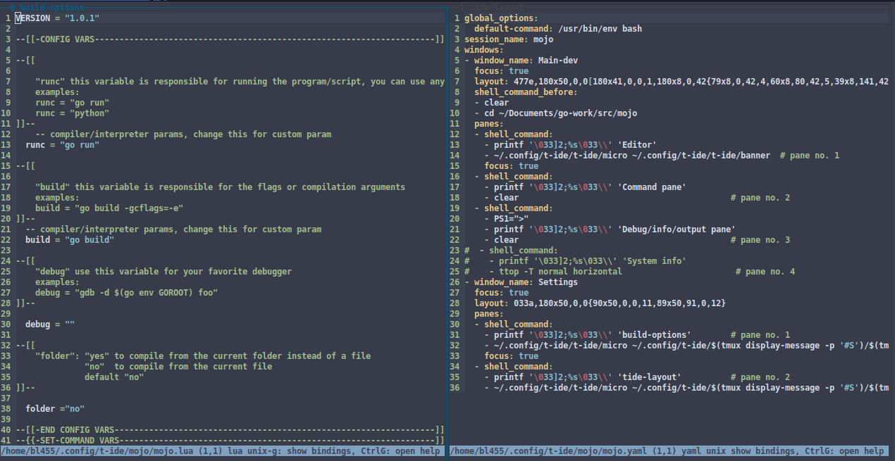

      _______         ___   ______   _______ 
     |       |       |   | |      | |       |
     |_     _| ____  |   | |  _    ||    ___|
       |   |  |____| |   | | | |   ||   |___ 
       |   |         |   | | |_|   ||    ___|
       |   |         |   | |       ||   |___ 
       |___|         |___| |______| |_______|

# Tmux based IDE 


Tide is a very simple IDE command line based on Tmux, the micro text editor, the Mcompiler add-on but above all very light.

The idea is to have IDE with the most basic aspects and avoid distractions and installations of unnecessary complements, which 
can also work on any computer with limited resources

Tide allows you to work with any language simply by changing the variables for the execution/construction/debugging in te build options windows

tide also supports profiles, this will allow you to work with different languages you just have to open a new terminal and write tide foo

## Getting Started

These instructions will get you Tmux based IDE

### Prerequisites

What things do you need to use t-ide:

```
latest tmux:              https://github.com/tmux/tmux

```

### Install and Running

After installing the prerequisites write in the terminal:

```
$ git clone https://github.com/Odyssey2247/t-ide
$ cd t-ide
$ chmod +x install
$ sudo ./install
$ tide
```
this open a tmux based ide

install script will install:
```
tmuxp session-manager:    https://github.com/tmux-python/tmuxp
ttop:                     https://github.com/ton1517/ttop
micro text editor:        https://github.com/zyedidia/micro
 micro filemanager plugin: https://github.com/NicolaiSoeborg/filemanager-plugin
 micro mcompiler plugin:   https://github.com/Odyssey2247/mcompiler
```

## Use

    usage:
    tide [profile] -d [profile] -l -t -a -k [profile] -h

    create/open profile:
     tide foo

    -d delete profile:
     tide -d foo

    -l list profiles:
     tide -l
  
    -t list tide sessions:
     tide -t
  
    -a kill all sessions
     tide -a
  
    -k kill profile from tmux session:
     tide -k foo
  
    -h this help:
  
    NOTE: All config files are locatet at: ~/.config/t-ide/t-ide
  

when t-ide runs you have 2 working windows:


	0:main-dev 

this windows contains text editor(micro) pane, command pane, debug/info/output pane, systeminfo pane

	1:build-options


This window opens the main configuration of the mcompiler plugin to 
be configured with custom parameters for commands "runc", "build", "debug"
to get all the output in panel 2 of the main window
this file is in

    ~/.config/t-ide/[profile]/[profile].lua

to compile or run your code open command mode in micro (ctrl+e) and use commands:

    runc   //run your code 
    build  //build yourcode
    debug  //debug yourcode
    
the output of the commands is shown in panel 2 (debug/info/output pane)
use the keybindings of tmux to move between the panels and or modify the panels

micro only runs in each session of tide with its own configuration, this will 
prevent conflicts with a different installation of micro

the configuration of the variables in the session initiated will be the same 
for all the micro instances within that session

example:
if you start a profile with variables configured to work with python, all the new instances of micro will work with the same variables

### Tide keybindings for micro

micro accepts keybindings instead of commands

    "F5": "runc",
    "F6": "build",
    "F8": "debug",
    "F9": "filemanager"    

F5: run runc command

F6: run build command

F8: run debug command

F9: show/hide filemanager

default list of keybindings for micro: https://github.com/zyedidia/micro/blob/master/runtime/help/keybindings.md

### Micro commands

use the micro commands to:
-open tabs
-open file manager
-split panels
-and more
A complete list of commands accepted by micro is here: https://github.com/zyedidia/micro/blob/master/runtime/help/commands.md

### Micro and filemanager plugin

micro is highly configurable and extensible via plugins. 
one of these plugins is filemenager allows you to have a 
directory tree to the left of the editing window (like an ide)

to open a tree hit ctrl+e and:

    tree

to move use:

    cursors up and down  

to open file:

    press tab

to close current pane (in micro):

    ctrl+q

to move between panels (in micro):

    ctrl+w

to open a new tab 
  
    ctrl+t

move between tabs

    alt+. alt+,

to start the file tree whenever the micro starts 
open command mode in micro (ctr+e) and:

    set filemanager-openonstart true

more options for this plugin: https://github.com/NicolaiSoeborg/filemanager-plugin

### Config t-ide panels

The configuration of the layout of the panels, titles and their size is 1: window:



add this to .tmux.conf for pane titles

    set -g pane-border-format "#{pane_index} #{pane_title}"
    set -g pane-border-status top
